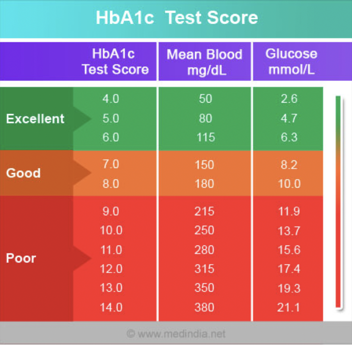

```{r setup, include=FALSE}
knitr::opts_chunk$set(echo = TRUE)
```

### Question 16. [1 mark] Include parts I and II of your project. 
### Question 1
**[2 marks] The first part of our PPDAC framework is to identify the problem your are addressing with these data. State the question you are trying to answer and let us know what type of question this is in terms of the PPDAC framework. A question statement should be as specific as possible, for example rather than;“how is sleep related to health” a specific question would be “Do students who regularly get 8 hours of sleep have fewer visits to the health center?”**

Question: “What is the association between number of medications taken and measured HbA1C levels within varying age brackets”

The question we are looking to answer is what the association between the number of medications taken and blood glucose levels of patients within varying age brackets is.  According to the PPDAC framework, this is a causative/ etiologic question, as we are trying to determine if changes in the explanatory variable (the number of medications taken) induce a change in the response variable (the blood glucose level of patients).  

\newpage

### Question 2
**[2 marks] Why is this question interesting or important? You could talk here about how existing data/studies suggest this might be important, how this question fills a gap in the scientific literature, how the findings might make an impact, and how the findings might be used.**

```{r png_upload}
# Take off the '#' in the following code and replace the code with you file name


```

The hemoglobin A1C test (HbA1C) is a blood test that measures an individual’s blood sugar levels over a three month period. HbA1C is a commonly used test to diagnose an individual with diabetes. By looking at the association between number of medications taken and A1C results, we can see if the number of medications that a patient is prescribed has any impact on a patient's mean blood sugar, which can be identified by looking at the result from their A1C test. A lot of public health literature is focused on diagnosis using measured biomarkers, so we wanted to address the gap in knowledge of whether post-diagnosis patients can minimize their blood sugar levels effectively through prescriptions.

\newpage

### Question 3
**[2 marks] What is the target population for your project? Why was this target chosen i.e., what was your rationale for wanting to answer this question in this specific population?**

Our target population for this project would be patients with Type 2 Diabetes that have a high chance of hospital readmission. Once a patient is diagnosed, there is minimal data analysis currently available on how to minimize symptoms when in critical care.  

\newpage

### Question 4
**[2 marks] What is the sampling frame used to collect the data you are using? It may be helpful here to read any protocol papers, trial registration records, ‘.Readme’ files or documentation that are associated with your dataset. If you have trouble identifying how the records/individuals were sampled, confirm with your supporting GSI that your dataset will be usable for the purposes of the class. Describe why you think this sampling strategy is appropriate for your question. To what group(s) would you feel comfortable generalizing the findings of your study and why.**

Sampling frame– Patients that fit the following criteria: 

1. It was an inpatient encounter (a hospital admission)
2. It was a diabetic encounter (one during which any kind of diabetes was entered to the system as a diagnosis)
3. The length of the stay was at least 1 day and at most 14 days
4. Laboratory tests were performed during the encounter
5. Medications were administered during the encounter

This sampling strategy directly focuses on Type 2 Diabetic patients in a hospital setting and specifically included patients that were prescribed medications, indicating that they were in a critical enough state to have to undergo immediate care. The confirmation of laboratory tests indicates that there is a quantitative measure to record health status for these patients so that the data can be best assessed. Without these aspects included in the sampling frame, our study analysis would be minimal and potentially insufficient.

This data was collected by means of health records.

\newpage

### Question 5
**[2 marks] Write a brief description (1-4 sentences) of the source and contents of your dataset. Provide a URL to the original data source if applicable. If not (e.g., the data came from your internship), provide 1-2 sentences saying where the data came from. If you completed a web form to access the data and selected a subset, describe these steps (including any options you selected) and the date you accessed the data.**

This data was taken from 130 US hospitals and integrated delivery networks over a period of 10 years (1999-2008).  

Data set: [link](https://archive.ics.uci.edu/ml/datasets/Diabetes+130-US+hospitals+for+years+1999-2008) \\
Data dictionary: [link](https://www.hindawi.com/journals/bmri/2014/781670/tab1/)

\newpage

### Question 6
**6. [1 mark] Write code below to import your data into R. Assign your dataset to an object. Make sure to include and annotate this code in your submission.**

```{r import-and-save-data}
library(dplyr)
library(readr)
library(tidyverse)
#Here, we import the original dataset
diabetes <- read_csv("diabetic_data.csv", show_col_types = FALSE)
```
\newpage

### Question 7
**[3 marks] Write code in R (included in your submission with annotation) to answer the following questions: i) What are the dimensions of the dataset? ii) What are the variable names of the variables in your dataset? iii) Print the first six rows of the dataset.**

```{r tags=c()}
glimpse(diabetes)
```

```{r tags=c()}
head(diabetes)
```

***After you run the code above, you will see a lot of variables that we are not going to use in our project. Thus, in this code below, we will eliminate some irrelevant columns and take the columns that we think might be useful for our next part of the project.***
```{r tags=c()}
diabetes_filtered <- diabetes %>% select(patient_nbr, race, gender, age, num_medications, A1Cresult)
glimpse(diabetes_filtered)
```
```{r tags=c()}
head(diabetes_filtered)
```
\newpage
### Question 8
**[2 marks] Use the data to demonstrate a data visualization skill we have covered during Part I of the course. Choose a visualization relevant to your stated problem. Include your code in your submission. For example, you could visualize the distribution of your outcome with a histogram, or use a bar graph to represent the distribution of your exposure variable.**

```{r histplot}
library(ggplot2)
library(readr)
library(broom)
```
\newpage

#### Statistical Analysis for HB1AC >7 (aged from 20-30) and Visualization #### 

```{r statistic_morethan7}
A1Cresult_2030 <- subset(diabetes_filtered, age %in% c("[20-30)"))
A1Cresult_more_than7 <- subset(A1Cresult_2030, A1Cresult %in% c(">7"))
# A1Cresult_more_than7
mean_more_than7 <- mean(A1Cresult_more_than7$num_medications, na.rm = TRUE)
# mean_more_than7
median_more_than7 <- median(A1Cresult_more_than7$num_medications,  na.rm = TRUE)
# median_more_than7
statistic_more_than7 <- c(mean_more_than7, median_more_than7, dim(A1Cresult_more_than7)[1])
statistic_more_than7
```
```{r plot_morethan7}
plot_diabetes1 <- ggplot(A1Cresult_more_than7, aes(x=num_medications)) + geom_bar() + labs(title= "Distribution of Number of Medications with HB1AC levels more than 7 [20-30)", x = "Number of Medications")
plot_diabetes1
```
\newpage

#### Statistical Analysis for HB1AC >8 (aged from 20-30) and Visualization #### 

```{r statistic_morethan8}
A1Cresult_more_than8 <- subset(A1Cresult_2030, A1Cresult %in% c(">8"))
# A1Cresult_more_than8
mean_more_than8 <- mean(A1Cresult_more_than8$num_medications, na.rm = TRUE)
# mean_more_than8
median_more_than8 <- median(A1Cresult_more_than8$num_medications, na.rm = TRUE)
# median_more_than8
statistic_more_than8 <- c(mean_more_than8, median_more_than8, dim(A1Cresult_more_than8)[1])
statistic_more_than8
```
```{r plot_morethan8}
plot_diabetes2 <- ggplot(A1Cresult_more_than8, aes(x=num_medications)) + geom_bar() + labs(title= "Distribution of Number of Medications with HB1AC levels more than 8 [20-30)", x = "Number of Medications")
plot_diabetes2
```

\newpage

#### Statistical Analysis for Normal Level of HB1AC (aged from 20-30) and Visualization #### 

```{r statistic_normal}
A1Cresult_normal <- subset(A1Cresult_2030, A1Cresult %in% c("Norm"))
# A1Cresult_more_than8
mean_normal <- mean(A1Cresult_normal$num_medications, na.rm = TRUE)
# mean_normal
median_normal <- median(A1Cresult_normal$num_medications, na.rm = TRUE)
# median_normal
statistic_normal <- c(mean_normal, median_normal,  dim(A1Cresult_normal)[1])
statistic_normal
```

```{r plot_normal}
plot_diabetes3 <- ggplot(A1Cresult_normal, aes(x=num_medications)) + geom_bar() + labs(title= "Distribution of Number of Medications with Normal HB1AC levels [20-30)", x = "Number of Medications")
plot_diabetes3
```
\newpage

#### Statistical Analysis when HB1AC was not measured (aged from 20-30) and Visualization #### 

```{r statistic_none}
A1Cresult_none <- subset(A1Cresult_2030, A1Cresult %in% c("None"))
# A1Cresult_none
mean_none <- mean(A1Cresult_none$num_medications, na.rm = TRUE)
# mean_none
median_none <- median(A1Cresult_none$num_medications, na.rm = TRUE)
# median_none
statistic_none <- c(mean_none, median_none, dim(A1Cresult_none)[1])
statistic_none
```

```{r plot_none}
plot_diabetes4 <- ggplot(A1Cresult_none, aes(x=num_medications)) + geom_bar() + labs(title= "Distribution of Number of Medications when HB1AC was not measured [20-30)", x = "Number of Medications")
plot_diabetes4
```
\newpage

#### Calculating standard deviation from each group ####

```{r sd_1st_plot}
sd1 <- sd(A1Cresult_more_than7$num_medications)
sd1
```

```{r sd_2nd_plot}
sd2 <- sd(A1Cresult_more_than8$num_medications)
sd2
```

```{r sd_3rd_plot}
sd3 <- sd(A1Cresult_normal$num_medications)
sd3
```

```{r sd_4th_plot}
sd4 <- sd(A1Cresult_none$num_medications)
sd4
```

\newpage

### Question 9
**[2 marks] Describe the skill that you are demonstrating and interpret your findings. For example, if you have created a histogram, describe the central tendency, shape of the distribution etc.**

_In Question 8, we demonstrate a visualization of the number medications given distributions based on HB1Ac (>7, >8, Normal, and Not Measured) levels from people aged from [20-30). For this data project, we will be going through all of the age brackets, but just for demonstration, we are going to use people aged from 20-30 and explain the distributions based on the bar plot above._

From the first plot, there are 30 people who had a HB1Ac levels over 7%. The mean number of medications is 13.1 and the median is 12 with a standard deviation of 8.48. The number of medications given to the patient are almost evenly spread out. So, as there are only 30 data in this group, we might assume that people aged from 20-30 had a little chance of having HB1Ac levels over 7%. In this group, we can tell that the range number of medication given is more spread out because some people might get less than 5 medications (this explains why this group has the highest standard deviation), but there also people who were required to consume more than 10 medications up to 35 medications. There might be other factor that might affect the number of medications beside the levels of HB1Ac. 

From the second plot, there are 334 people who had a HB1Ac levels over 8%. This plot is skewed to the right with a mean number of medications is 11.72 and the median is 11 with a standard deviation of 6.23. From the statistical analysis above, there were almost 11x people aged from 20-30 who had a HB1Ac levels more that 8%. In this group, most of them were given around 11-12 medications, around the same as the other three groups. From this plot, we know that there are more people aged from 20-30 who had a HB1Ac levels more than 8%

From the third plot, there are 84 people who had a normal HB1Ac levels. The mean number of medications is 12.48 and the median is 12. The mean number of medications among 20-30 groups are almost the same and the same goes for the last plot, there are 1209 people whose HB1Ac levels was not measured but the distributions of this plot is also skewed to the right with the mean number of medications of 11.98 and the median is 11. 

Moving forward, we are going to apply this all the analysis for all of the age brackets and compared them between age groups. 

\newpage

### Question 10 [1 mark] Include your work for Part I

\newpage

### Question 11 [3 marks] Describe the type of theoretical distribution that is relevant for your data. • What type of variable(s) are you investigating (continuous, categorical, ordinal, etc)? • What theoretical distribution that we have talked about would potentially be appropriate to use with these data (Normal, Binomial, Poisson...) • Why is this an appropriate model for the data you are studying? (HINT what are the assumptions of this distribution) 

Other variables in the data set include weight, for which we could use a normal distribution, but due to the large # of missing values present, it would not be wise.
 
Variables: 
HbA1C levels for patients aged 20-30 years old = categorical(ordinal)
Gender = binary variable, categorical (nominal)

A Binomial model would be an appropriate model for the data we are studying, as the number of observations are fixed, each observation has the same probability of success, and each observation is independent of each other. 

\newpage

### Question 12 [2 marks]- What are the parameters that define this distribution?- Calculate these parameters for your data. 
Binomial distribution plotted in a Histogram for three different categories: 7< HbA1C < 8, HbA1C > 8 , normal, and not measured. We will be looking at just the HbA1C > 8 category.
The parameters that define a binomial distribution are n (the number of sampled observations) and p (the underlying probability).  
HbA1C > 8
```{r q12}
male_morethan8 <- nrow(A1Cresult_2030[A1Cresult_2030$gender == 'Male' & A1Cresult_2030$A1Cresult == '>8', ]) 
male_morethan8
female_morethan8 <- nrow(A1Cresult_2030[A1Cresult_2030$gender == 'Female' & A1Cresult_2030$A1Cresult == '>8', ]) 
female_morethan8

binomial_male <- male_morethan8 / 543
binomial_male
binomial_female <- female_morethan8 / 1114
binomial_female
```
\newpage

### Question 13 [2 marks] Use your outcome data to calculate a probability. Provide an equation (use fpr,a; probability notation) that describes this probability. Note whether this probability is a conditional or a marginal probability. For example if my outcome variable is height in inches, I might calculate the probability that an individual in the dataset has a height of greater than 5 feet 10 inches. 

Disclaimer: *We will be basing our probabilities off of the calculated glucose levels for patients with HbA1C levels > 8*

Question: What is the probability that greater than 200 women ranging from ages 20-30 have an HbA1C > 8 measured? This would be a marginal probability.
PBinom( x > 200 )  ~  pbinom(200, 1114, 0.18,  lower.tail=FALSE)

```{r q13}
q13 <- pbinom(200, 1114, 0.18,  lower.tail=FALSE)
q13
```
\newpage

### Question 14 [2 marks] What type of variable is your primary exposure of interest? If this variable is a demographic variable (age, gender identity, race/ethnic identity) explain how the categories of this variable are defined and what the rationale is for this (for example if gender identity is being used, is the idea to capture something about biology ie using gender identity as a marker for genetic or phenotypic sex, or as a marker of social exposures). If your data is not from a randomized trial where your exposure of interest was randomly assigned, are there important factors that may have affected how this exposure was distributed? 

Our exposure variables are those between the ages of 20-30 years old and gender. Our outcome of interest is HbA1C levels. We used a defined age category in order to have a more conclusive result from our data on a specific age group and we also observed the probability of having an HbA1C > 8 based on gender in order to see whether gender had an impact on likelihood of high glucose levels within this age range. Our data was gathered from a total of 10 hospitals, so the area in which the hospitals were chosen would impact the overall HbA1C levels in the total population, as well as the gender quantities that may be documented in this data set. 

\newpage
### Question 15 [4 marks] Use your data to create a visualization of your data that begins to explore your research question. Include code in R, a visual of some kind and text interpretation. For example, if you outcome is height of children at age 10 and your predictor variable is exposure to food insecurity in the first year of life, you could provide a histogram of height among children exposed to food insecurity and a separate histogram of height among children not exposed to food insecurity. Make sure you describe your interpretation of the results.

```{r gender}
data_gender <- A1Cresult_2030 %>% select(c(3,6))
data_gender
```
```{r gender_plot}
gender_plot <- ggplot(data_gender, aes(A1Cresult)) + geom_bar(col = 'black', aes(fill=gender)) +facet_wrap(~gender) + labs(title= "Distribution of HB1AC levels based on gender aged [20-30)") + scale_y_continuous(labels = scales::percent_format(accuracy = 1)) + geom_text(aes(label = ..count..), stat = "count", vjust = -0.5, colour = "black")
gender_plot
```

The graph represents the HbA1C level results for both male and female patients. The data is displayed in a grouped bar chart format, which allows for a clear comparison between the two groups. The x-axis represents the different categories of A1C level ranges, and the y-axis displays the proportion of patients within each range. The bars are colored differently to differentiate between the female and male patients.

Upon examination of the graph, we can observe that the number of female patients with A1C levels in the lower range (between 7-7.9) is higher than the number of male patients in the same range. Specifically, there are 1114 female patients in total compared to 543 male patients, indicating that the female sample size is twice that of males. We can also note that the proportion of female patients in the higher A1C range (greater than 8.0) is approximately 20%, while the proportion of male patients in the same range is approximately 15%. This data suggests that the distribution of females with Hb1AC levels greater than 8 is higher than that of males.

From the information presented in the graph, we can make an inference that there may be gender-specific factors that influence A1C levels. The observed differences between the male and female patients could be indicative of underlying physiological, behavioral, or environmental factors that impact A1C levels differently between the two genders. Further analysis and research could potentially help identify these factors and provide insight into how to optimize A1C levels for both males and females.


### Question 17. [2 marks] Identify a statistical test to apply to your data (must be a statistical test that we cover in part III of the course). Name the statistical test you have chosen and explain why this is the appropriate test for these data. (for example, if I have a pre and post intervention measure of morning sleepiness that is quantitative, I might choose a paired t test, because the paired t test is appropriate for continuous outcome data in 2 groups that are inherently related) 

The Chi squared test is used to check if two variables are related. This is an appropriate test to apply for our data, as we will be seeing if our male and female populations are statistically related with one another. Our male and female variables are categorical binary, so we can compare them using a chi squared test.

### Question 18. [2 marks] What assumptions are required by the testing method you chose? Are these assumptions met by your data? How did you assess this? For example, one of the assumptions of the t-test is that the data are normally distributed, so you might choose to assess this with a histogram, or a q-q plot. 

Assumptions of the Chi squared test for independence
Must have either data arising from:
1. Independent SRSs from >= 2 populations, with each individual classified according to one category (i.e., each individual can only    belong to one cell in the table so the categories need to be mutually exclusive)
2. A single SRS, with each individual classified according to each of two categorical variables.

Our data fulfills the second condition, as the data is taken from a SRS and each entry is split into one of two categories– male or female.

### Question 19. [2 marks] Clearly state the null and alternative hypotheses for your test. 

Null: There is no relationship between gender(male & female) and HbA1C levels(>7, >8, Normal, None)
Alternative: There is a relationship between gender(male & female) and HbA1C levels(>7, >8, Normal, None)

### Question 20. [2 marks] Conduct the statistical test. Include the R code you used to generate your results. Annotate your code to help us follow your reasoning. 
``` {r testingdata}
# count the number of patients for each HbA1C levels for male and female
male <- subset(diabetes_filtered, gender %in% c("Male"))
male_over7 <- subset(male, A1Cresult %in% c(">7"))
male_over8 <- subset(male, A1Cresult %in% c(">8"))
male_normal <- subset(male, A1Cresult %in% c("Norm"))
male_none <- subset(male, A1Cresult %in% c("None"))

female <- subset(diabetes_filtered, gender %in% c("Female"))
female_over7 <- subset(female, A1Cresult %in% c(">7"))
female_over8 <- subset(female, A1Cresult %in% c(">8"))
female_normal <- subset(female, A1Cresult %in% c("Norm"))
female_none <- subset(female, A1Cresult %in% c("None"))
```

``` {r statistical_test}
x1 <- nrow(male_over7)
x2 <- nrow(male_normal)
x3 <- nrow(female_over7)
x4 <- nrow(female_normal)

y1 <- nrow(male_over8)
y2 <- nrow(male_none)
y3 <- nrow(female_over8)
y4 <- nrow(female_none)
  
hb_gender <- matrix(c(x1, y1, x2, y2, x3, y3, x4, y4), nrow=2, byrow=TRUE)
colnames(hb_gender) <- c(">7", ">8", "Normal", "None")
rownames(hb_gender) <- c("Male", "Female")

# Perform a chi-square test
chisq.test(hb_gender)
```

### Question 21. [4 marks] Present your results in a clear summary. This should include both a text summary and a table or figure with appropriate labeling. For example, if your outcome and predictor/exposure variables are both binary, this might be a 2x2 table. If your method was regression, you might present your regression line graphically. 

``` {r table}
hb_gender <- matrix(c(x1, y1, x2, y2, x3, y3, x4, y4), nrow=2, byrow=TRUE)
colnames(hb_gender) <- c(">7", ">8", "Normal", "None")
rownames(hb_gender) <- c("Male", "Female")
hb_gender
```

The p-value of 5.391e-13 is a very small value, much smaller than the conventional significance level of 0.05. This indicates strong evidence against the null hypothesis, which states that there is no association between the variables being tested. Therefore, the result suggests that there is a significant association between the variables.

In conclusion, based on this result, we can reject the null hypothesis and conclude that there is a significant association between the variables being tested.

### Question 22. [4 marks] Interpret your findings. Include a statement about the evidence, your conclusions, and the generalizability of your findings. Our analysis and conclusions depend on the quality of our study design and the methods of data collection. Any missteps or oversights during the data collection process could potentially change the outcome of what we are trying to find. Consider the methods used to collect the data you analyzed. Was there any potential issue in how the participants were selected/recruited, retained, or assessed that may have impacted the outcome of your analysis/visualization? Were there any potential biases that you might be concerned about? Were there factors that were not measured or considered that you think could be important to the interpretation of these data? 

Critical value for a value of 0.05 and 3 deg freedom = 7.815
Chi-squared value = 60.176
P-value = 5.391e-13

The Chi-squared value is greater than the critical value (60.176 > 7.815), which indicates that we can reject the null hypothesis and accept the alternative hypothesis that there is a relationship between gender and HbA1C levels. The recorded p-value of 5.391e-13 (p < 0.05) deems the test significant. The age range of participants was skewed left and the average participant for all HbA1C levels were typically above the age of 40. There were also a large amount of HbA1C levels that were not reported, entailing that our data had a small sample size of reported values in comparison to the number of registered participants in the study. The chi-squared test is sensitive to sample size, which is why this may have played a factor in our results. There were several factors that were also not reported consistently, such as weight, that could have been a variable of interest to monitor. Because the data was collected from 130 different hospitals over a span of 10 years, the data does not have a selective hospital bias, but we do not know which areas these hospitals are located, and therefore do not know if the demographics within these hospital regions are comparable.

### Question 23. Statement of contribution:

For data project part 1, Kamya and Rebecca completed questions 1-5 and Alana and Gabrielle completed questions 6-9. For data project part 2, Kamya, Rebecca, & Alana completed questions 11-14. Gabrielle completed questions 10 & 15. For data project part 3 Kamya, Rebecca, and Alana completed questions 17, 18, 19, 22, and 23. Gabrielle completed question 16, 20 & 21. 

Study set-up and test establishment: KK, RH. Statistical interpretation: AL. R-visualizations and data analysis: GH. Final Submission preparation: KK, RH, AL, GH. All authors contributed to the article and approved the submitted version


